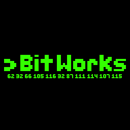

# Event-Tool

BitWorks Event-Tool ist eine Event-Management-Software, die am DHBW Campus Horb als Studentenprojekt entwickelt wird.

## Die Entwickler

Unser Team setzt sich aus 5 Studenten des Studiengangs Informatik zusammen.

| Role                                              | Name                 |
| ------------------------------------------------- | -------------------- |
| Project-Leader                                    | Tobias&nbsp;Schuhmacher |
| Technical Assistent and Test Commissioner                              | Jonathan&nbsp;Kalmbach    |
| Research Commissioner                   | Sean&nbsp;Reich    |
| Implementation Commissioner        | Jonas&nbsp;Braun     |
| Modelling- und Quality Assurance- und Documentation Commissioner | Christian&nbsp;Merkens     |
